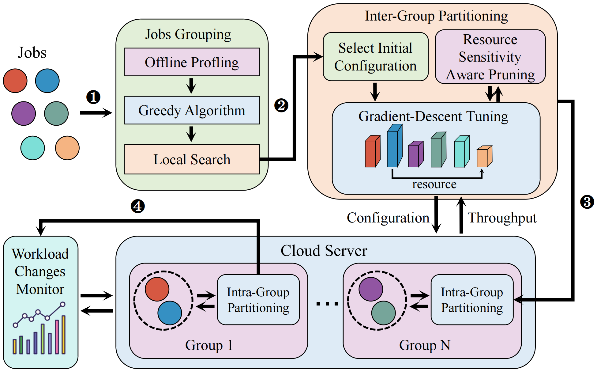

# Lavender: An Efficient Resource Partitioning Framework for Large-Scale Job Colocation



Lavender is tested on a Ubuntu Server 20.04.4 with Linux 5.4.0 using Python3.8. Please install the following library depencies for running Lavender.
# Dependencies
```
pip3 install numpy  
pip3 install itertools 
apt-get install intel-cmt-cat
```

Lavender uses the Linux _perf_ to collect runtime status of each job for guiding the quick and smart exploration. 
Please ensure that Intel CAT, MBA, and taskset tools are supported and active in your system.
Click this link to confirm: https://github.com/intel/intel-cmt-cat.

# The benchmark suites evaluated in Lavender

PARSEC 3.0: https://parsec.cs.princeton.edu/parsec3-doc.htm

ECP Suite 4.0: https://proxyapps.exascaleproject.org/ecp-proxy-apps-suite/

Splash-3: https://github.com/SakalisC/Splash-3


# Run Lavender

## File Description
```
run.py : main algorithm of Lavender
util.py : some tool functions
```
## Optional Parameters
```

can set optional parameters in train.py, include:
    :param G_1_ROUNDS: The number of Latin hypercube sampling in inter-group process
    :param G_2_ROUNDS: Maximum number of iterations of gradient descent algorithm in inter-group process
    :param A_1_ROUNDS: The number of Latin hypercube sampling in intra-group process
    :param A_2_ROUNDS: Maximum number of iterations of gradient descent algorithm in intra-group process
    :param PERCENT_DECSEND: Threshold to trigger the update of the lower bound of prune mechanism
    :param PERCENT_RAISE: Threshold to trigger the update of the upper bound of prune mechanism
    
```                               
## run program:
    python run.py